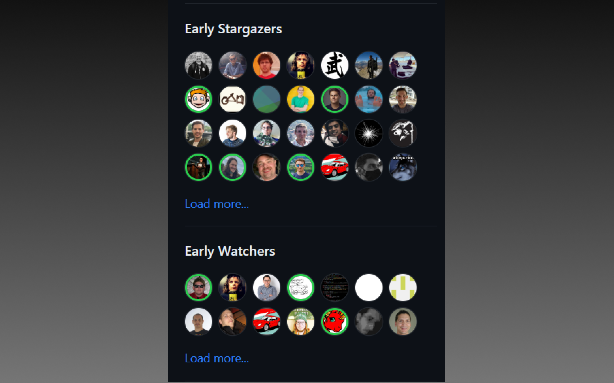

# Github Early

[English](../README.md) / [繁體中文](.)

Github Early 展示一個專案最早期按星星及追蹤的使用者。

### 這有什麼用？

> 當在瀏覽一個有規模的 Github 倉庫 (例如 [Node.js](https://github.com/nodejs/node))，我常常會思考是怎麼樣的一群人在最初始階段就關注這些潛力無限大的專案。這些人可能是專案創始者的夥伴朋友、行業內的骨灰級人物，也可能是即將幹大事的年輕人。

Gitub Early 提供給您一種全新探索 Github 的方式，為每個 Github 倉庫呈現最早的關注者 (Early Stargazers 及 Early Watchers) 😄。

### 如何安裝 & 使用

還沒寫...

### 給予支持

若我的程式有幫助到你，請給我的倉庫一顆星星 (成為這個專案的 Early 吧, Haha)。
您也可以請我喝杯咖啡 ([連結](https://www.buymeacoffee.com/dalufish))，鼓勵我繼續創作及維護應用程式。